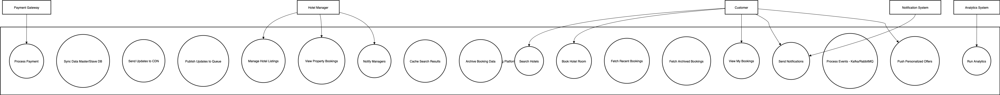

<!-- TABLE OF CONTENTS -->

# 📗 Table of Contents

- [📖 About the Project](#about-project)
  - [🛠 Built With](#built-with)
    - [Tech Stack](#tech-stack)
  - [🎨 UI/UX Design Planning](#ui-ux-design-planning)
    - [Key Features](#key-features)
    - [Design Goals](#design-goals)
    - [Primary Pages](#primary-pages)
    - [Colours, Styles,and Typography](#styling)
  - [🧩 UI Component Patterns](#ui-components)
  - [🚀 Live Demo](#live-demo)
  - [👤 + 📝 Project Roles and Responsibilities](#project-roles)
- [💻 Getting Started](#getting-started)
  - [Setup](#setup)
  - [Prerequisites](#prerequisites)
  - [Usage](#usage)
- [👥 Authors](#authors)
- [🔭 Future Features](#future-features)
- [🤝 Contributing](#contributing)
- [⭐️ Show your support](#support)
- [🙏 Acknowledgements](#acknowledgements)
- [📝 License](#license)

<!-- PROJECT DESCRIPTION -->

# Requirement Analysis in Software Development

# 📖 [requirement-analysis-in-software-development] 

**[requirement-analysis]** This repo aims to explain the concept of requirement analysis which is a skill essential for managing and delivering robust software systems by focusing on the cornerstone of successful development.

## What is Requirement Analysis? 

Requirement Analysis is a critical phase in the software development lifecycle (SDLC) where the project team gathers, analyzes, and defines the requirements of the software product to be developed. This process ensures that all stakeholders have a clear and mutual understanding of what the system should do and how it should perform.

<a href="#readme-top">👆</a>

## Why is Requirement Analysis Important? 

- **Clarity and Understanding**: It helps in understanding what the stakeholders expect from the software, reducing ambiguity.
- **Scope Definition**: Clearly defines the scope of the project, which helps in preventing scope creep.
- **Basis for Design and Development**: Provides a solid foundation for designing and developing the system.
- **Cost and Time Estimation**: Facilitates accurate estimation of project cost, resources, and time.
- **Quality Assurance**: Ensures that the final product meets the specified requirements, leading to higher customer satisfaction.

<a href="#readme-top">👆</a>

<!-- Key Activities -->
## Key Activities in Requirement Analysis

<!-- Requirement Gathering -->
###  Requirement Gathering 🗂️ 
- **Interviews**: Conducting interviews with stakeholders to gather detailed information about their needs and expectations.
- **Surveys/Questionnaires**: Distributing surveys to collect requirements from a larger audience.
- **Workshops**: Organizing workshops with stakeholders to discuss and gather requirements.
- **Observation**: Observing end-users in their working environment to understand their needs.
- **Document Analysis**: Reviewing existing documentation and systems to understand current functionalities and requirements.

<!-- Requirement Elicitation -->
### Requirement Elicitation ✍️ 
- **Brainstorming**: Conducting brainstorming sessions to generate ideas and gather requirements.
- **Focus Groups**: Holding focus group discussions with selected stakeholders to gather detailed requirements.
- **Prototyping**: Creating prototypes to help stakeholders visualize the system and refine their requirements.

<!-- Requirement Documentation -->

### Requirement Documentation 📚 
- **Requirement Specification Document**: Creating a detailed document that lists all functional and non-functional requirements.
- **User Stories**: Writing user stories to describe functionalities from the user’s perspective.
- **Use Cases**: Creating use case diagrams to show interactions between users and the system.

<!-- Requirement Analysis and Modeling  -->

### Requirement Analysis and Modeling 📊 
- **Requirement Prioritization**: Prioritizing requirements based on their importance and impact on the project.
- **Feasibility Analysis**: Assessing the feasibility of requirements in terms of technical, financial, and time constraints.
- **Modeling: Creating models** (e.g., data flow diagrams, entity-relationship diagrams) to visualize and analyze requirements.

<!--  Requirement Validation  -->

###  Requirement Validation ✅ 
- **Review and Approval**: Reviewing the documented requirements with stakeholders to ensure accuracy and completeness.
- **Acceptance Criteria**: Defining clear acceptance criteria for each requirement to ensure they meet the expected standards.
- **Traceability**: Establishing traceability matrices to ensure all requirements are addressed during development and testing.

<a href="#readme-top">👆</a>

<!-- Types of Requirements -->

## Types of Requirements 

### 1. Functional Requirements
**Definition**: Describe what the system should do.
#### Hotel Management
  - Add, update, and delete hotel/property listings (name, location, price, rooms, amenities, photos).  
  - Sync data between Master DB (write) and Slave DB (read).  
  - Push hotel updates to CDN for faster customer delivery.  
  - Publish updates to a messaging queue (Kafka/RabbitMQ).  

#### Customer Search & Booking
  - Search hotels by filters (location, price, date, amenities, rating).  
  - Display search results quickly using **Elasticsearch + CDN**.  
  - Book hotel rooms in real time with availability locking.  
  - Integrate with third-party **payment gateways** (Stripe, PayPal, etc.).  
  - Cache frequently accessed search data in **Redis**.  
  - Store booking history in DB; archive older records in **Cassandra**.  

#### View Bookings
  - Customers can view **upcoming and past bookings**.  
  - Managers can view bookings for their properties.  
  - Recent bookings retrieved via **Redis cache**.  
  - Archived bookings retrieved from **Cassandra**.  

#### Notifications & Analytics
  - Notify customers (confirmation, cancellation, offers) and managers (new bookings).  
  - Stream booking events to **Kafka** for real-time processing.  
  - Store events/transactions in **Hadoop** for big data analytics.  
  - Support **personalized offers and recommendations**.  

### 2. Non-functional Requirements
**Definition**: Describe how the system should perform.
#### Performance
  - Search results in **< 200ms**.  
  - Booking confirmation/status updates in **< 2 seconds**.  
  - Recent booking history loads in **< 300ms**.  

#### Scalability
  - Handle **millions of daily searches/bookings**.  
  - Services designed with **microservices + containers** (Kubernetes/Docker).  
  - Elasticsearch, Redis, and Cassandra clusters scale horizontally.  

#### Reliability & Availability
  - **99.9% uptime** with redundancy.  
  - Master–slave DB replication for fault tolerance.  
  - Kafka/Redis/Cassandra configured with **replication + failover**.  

#### Consistency & Data Integrity
  - Master DB for writes; Slaves for reads.  
  - Prevent **double-booking** via distributed locks.  
  - Eventual consistency for search index and cache acceptable.  

#### Security & Compliance
  - Encrypt data in transit (**TLS**) and at rest (**AES**).  
  - **PCI-DSS** compliance for payments.  
  - **GDPR** compliance for user data privacy.  
  - Role-based access for managers vs customers.  

#### Usability
- Intuitive UI for customers and managers.  
- **Multilingual** and **multi-currency** support.  

#### Durability
- Archived booking data persisted in **Cassandra**.  
- Backup + recovery mechanisms for all critical DBs.  

#### Observability
- Centralized monitoring (**Prometheus, Grafana**).  
- Alerts for latency, failures, downtime.  

<a href="#readme-top">👆</a>

<!--Use Case Diagrams-->

## Use Case Diagrams 

### 🎭 What are Use Case Diagrams 

Use Case Diagrams are simple, high-level diagrams that model how users interact with a system. They are valuable because they communicate functionality clearly, align stakeholders, define scope, and support later phases like design, testing, and documentation.

### Benefits of Use Case Diagrams 
- Clarity of Requirements
- Stakeholder Communication
- Identifying System Boundaries
- Supports Requirement Gathering
- Foundation for Design & Testing

<a href="#readme-top">👆</a>

<!-- Acceptance Criteria-->

## Acceptance Criteria 

<a href="#readme-top">👆</a>

<!-- AUTHORS -->

## 👥 Author 

👤 **Author**
 *[Kenny Henshaw]*

- GitHub: [Armynerh](https://github.com/Armynerh)
- LinkedIn: [Kehinde Henshaw](https://www.linkedin.com/in/kehinde-aminah-h/)

<a href="#readme-top">👆</a>

<!-- Contributing -->

## 🤝 Contributing 

Contributions, issues, and feature requests are welcome!

Feel free to check the [issues page](../../issues/).

<a href="#readme-top">👆</a>

<!-- Show your support -->

## ⭐️ Show your support 

If you like this project leave a star.

<a href="#readme-top">👆</a>

<!-- ACKNOWLEDGEMENTS -->

## 🙏 Acknowledgments 

I would like to thank Alx for helping me on my journey to become a pro frontend developer.

<a href="#readme-top">👆</a>

<!-- LICENSE -->

## 📝 License 

This project is [MIT](./LICENSE) licensed.

<a href="#readme-top">👆</a>
